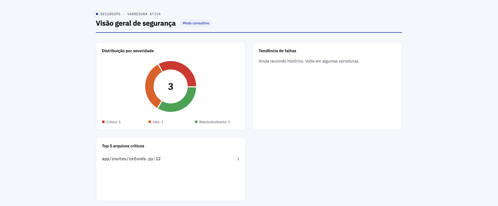
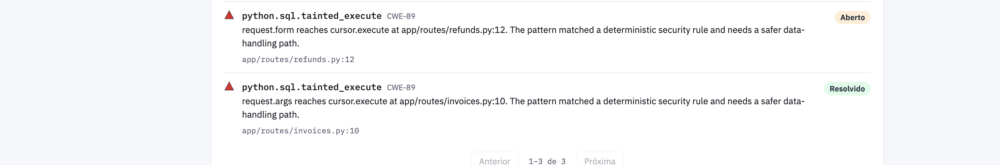
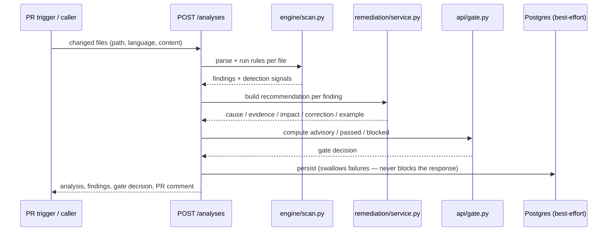

# SecureOps

**A PR-first vulnerability feedback service.** SecureOps scans a pull request's
changed files, runs deterministic and data-flow security rules against them,
and hands back structured findings — cause, evidence, impact, a recommended
fix, and a safe example — plus a gate decision and a ready-to-post PR
comment. Analysis happens inline in the request; there's no queue or worker.

Two parts live in this repository:

- **`secureops/`** — the FastAPI backend: the analysis engine, gate logic,
  remediation service, and persistence.
- **`frontend/`** — a React/Vite dashboard that reads the backend's read-only
  analytics endpoints (severity distribution, weekly trend, top critical
  files, a filterable findings list with inline status overrides).

## Screenshots

**Dashboard overview** — masthead, severity donut, weekly trend, and top
critical files:



**Findings list detail** — an override made through the dashboard
(`accepted_risk`/`resolved`) surviving a later re-scan of the same code,
shown by fingerprint:



> Screenshots are captured locally, not generated by CI — see
> [Regenerating the screenshots](#regenerating-the-screenshots) if the images
> above are missing or stale.

## How a PR gets scanned



Findings are fingerprinted (repo + file + rule + category + anchor +
evidence + line) so a manual override — "false positive", "accepted risk" —
survives a re-scan of the same code instead of resetting to `open` every
time.

For the system/container-level view (what talks to what, and why each
external dependency is designed to degrade rather than fail), see
[docs/architecture/c4-context.md](docs/architecture/c4-context.md) and
[docs/architecture/c4-container.md](docs/architecture/c4-container.md). For a
walkthrough script (checkpoint/defense demo), see
[docs/demo-script.md](docs/demo-script.md).

## Key properties

- **Actionable by construction.** Every published finding carries `cause`,
  `evidence`, `impact`, `recommended_correction`, and `safe_example`. If the
  local Ollama remediation model is slow, unavailable, or returns an
  incomplete recommendation, a reviewed static template fills the gap — AI is
  an enhancement, never a single point of failure.
- **Blocking is opt-in and narrow.** Default mode is `advisory` (never
  blocks). In `blocking_enabled` mode, a finding can only block merge if it's
  `critical`, `open`, and backed by **two or more independent deterministic**
  detection signals. AI-assisted classification alone never blocks anything.
- **Two languages, intentionally unequal depth.** Python is the primary
  language: AST rules plus data-flow (taint) tracking from untrusted input to
  sensitive sinks. JavaScript is a secondary language with one supported
  deterministic rule (`javascript.dom.inner_html`, CWE-79) and explicitly no
  data-flow tracking. This asymmetry is documented and enforced by
  `app/models/enums.py`, not a gap waiting to be "fixed" into false parity.
- **Minimal, visible governance.** A reviewer can override a finding's status
  with a reason; the change is appended to an immutable history and survives
  re-analysis — without pretending to be a full RBAC/audit-log system.

## Quickstart

### Backend

```bash
cd secureops
pip install -e ".[dev]"          # editable install + pytest/ruff
cp .env.example .env             # point DATABASE_URL at your Postgres
alembic upgrade head
uvicorn app.main:app --reload    # http://localhost:8000
```

### Frontend

```bash
cd frontend
npm ci
npm run dev                      # http://localhost:5173
```

The dashboard needs `VITE_DASHBOARD_REPOSITORY` set to a repository that
actually has analyses in the database — see `frontend/.env.development` and
`frontend/README.md`.

### Or: everything with Docker Compose

```bash
docker compose up --build
# API:       http://localhost:8000
# Dashboard: http://localhost:8080
```

Starts Postgres, runs `alembic upgrade head` on container start, and builds
the dashboard as a static bundle served by nginx. Ollama is intentionally
**not** part of the compose stack — see the comment in `docker-compose.yml`;
point `OLLAMA_BASE_URL` at a host-run Ollama if you have one, otherwise the
API falls back to reviewed templates as designed.

The `api` service mounts the whole repo read-only at `/workspace`, so a
`content_ref` in a `POST /analyses` request resolves the same way it does in
CI: `/workspace/secureops/tests/fixtures/python_vulnerable/command_injection.py`
for the bundled fixtures, or `/workspace/<path-from-repo-root>` for anything
else checked out alongside it.

### Try it end to end

```bash
curl -s -X POST localhost:8000/analyses -H "Content-Type: application/json" -d '{
  "repository": "secureops",
  "pull_request_number": 1,
  "commit_sha": "5555555555555555555555555555555555555555",
  "trigger": "pull_request",
  "mode": "advisory",
  "changed_files": [
    {"path": "app/routes/admin.py", "language": "python",
     "content_ref": "tests/fixtures/python_vulnerable/command_injection.py"}
  ]
}'
```

A real response, trimmed to one finding:

```text
### Finding: high - `python.subprocess.shell_true` (CWE-78)
- Location: app/routes/admin.py:8

**Cause**
Untrusted input command is passed into subprocess.run at app/routes/admin.py:8.
Building a shell command from request-controlled data allows the shell to
interpret metacharacters as additional commands.

**Recommended correction**
Replace the shell invocation with subprocess.run using an explicit argument
list, validate the allowed operation, and pass only normalized values.

**Safe example**
from pathlib import Path
import subprocess

safe_name = Path(command).name
subprocess.run(["convert", safe_name], check=True)
```

and the matching gate decision, in default advisory mode:

```json
{ "mode": "advisory", "decision": "advisory_only", "reasons": ["Advisory mode does not block merge."] }
```

## Configuration

Environment-driven via `secureops/app/config.py` (`pydantic-settings`),
loaded from `secureops/.env`:

| Variable | Default | Purpose |
| --- | --- | --- |
| `DATABASE_URL` | — | Postgres connection; persistence is best-effort and failures are swallowed so the API keeps working without a database |
| `GATE_MODE` | `advisory` | `advisory` never blocks; `blocking_enabled` allows restricted deterministic blocking |
| `SECONDARY_LANGUAGE` | `javascript` | The one secondary language analyzed alongside Python |
| `OLLAMA_BASE_URL` / `OLLAMA_MODEL` / `OLLAMA_TIMEOUT_SECONDS` / `OLLAMA_FALLBACK_ENABLED` | — | Local remediation model; falls back to reviewed templates when unavailable |
| `DASHBOARD_FRONTEND_ORIGIN` | `http://localhost:5173` | CORS origin allowed to call `/dashboard/*` |

## Testing

```bash
cd secureops && python -m pytest        # 73 tests: unit, integration, validation
cd frontend  && npm test                # 11 tests: vitest + Testing Library
```

Backend tests don't need a live Postgres or Ollama instance — persistence
and AI calls are designed to fail soft. The dashboard's own analytics
endpoints are the one exception: they're **not** fail-soft, so a broken
store surfaces as a `503`, not an empty response (`tests/integration/test_dashboard_api.py`).

## Project structure

```
secureops/                  FastAPI backend
├── app/api/                 analyses, findings, gate, dashboard endpoints
├── app/engine/               parser, deterministic rules, taint analysis, fingerprinting
├── app/remediation/           Ollama client + reviewed-template fallback
├── app/github/                 PR comment + status/check formatting
└── tests/{unit,integration,validation}/

frontend/                   React/Vite dashboard
├── src/components/dashboard/  the 4 widgets (donut, trend, top files, findings list)
├── src/components/shared/      status badge, severity icon, skeleton, error state
├── src/api/                     typed fetch client for /dashboard/* and /findings/*
└── src/design/tokens.ts          color/type/spacing tokens

specs/001-secureops-pr-feedback/  Spec Kit feature spec, plan, data model, task list
.specify/memory/constitution.md   the 5 binding governance principles below
```

## Governance

This project runs under a versioned constitution
(`.specify/memory/constitution.md`) with five binding principles:

1. Findings must stay actionable — don't grow rule coverage at the expense
   of explanation quality.
2. Automatic blocking is opt-in and narrowly scoped — never dependent on AI
   judgment alone.
3. Python vs. secondary-language coverage is deliberately unequal — never
   imply parity.
4. AI components must never be a single point of failure — every
   AI-assisted feature needs a deterministic/template fallback.
5. Academic/checkpoint traceability must not distort the product.

## CI: the SecureOps gate on its own PRs

`.github/workflows/secureops-gate.yml` dogfoods the product: every PR
against this repo builds the `secureops/Dockerfile` image, runs it against a
real Postgres service container, and POSTs the PR's changed files (filtered
to `.py`/`.js`/`.jsx`/`.mjs`/`.cjs`, via `scripts/ci_build_analysis_payload.py`)
to its own `/analyses` endpoint in `blocking_enabled` mode. A `blocked` gate
decision fails the check. On same-repo PRs, the app's own publisher
(`app/github/publisher.py`, [T071](specs/001-secureops-pr-feedback/tasks.md))
also posts the generated feedback comment and commit status —
`GITHUB_TOKEN` has no write access on PRs from forks, so that part is a
best-effort no-op there rather than a failure.

## Known limitations

- CI publishing (comment + commit status) only works on same-repo PRs, not
  forks — see the CI section above.
- The quickstart targets Python 3.12; local validation here has run on
  Python 3.9.2.
- JavaScript coverage is intentionally minimal (one deterministic rule, no
  data-flow) — by design, see Governance principle 3.
- The dashboard has no live query for gate mode; it mirrors the backend's
  `GATE_MODE` via a frontend env var instead (`frontend/.env.development`).
- No dark mode yet.

See `secureops/README.md` and `frontend/README.md` for the full detail
behind each of these.

## Contributing

See [`AGENTS.md`](AGENTS.md) for repo layout, build/test/lint commands,
coding style, and commit/PR conventions.

## Regenerating the screenshots

The screenshots above aren't generated by CI — this environment's container
can't run a browser (Playwright has no build for this platform), so they're
captured by hand against a locally seeded backend:

1. Start the backend (`uvicorn app.main:app --reload`) against a Postgres
   instance and run `alembic upgrade head`.
2. Seed a few analyses for whatever repository your frontend's
   `VITE_DASHBOARD_REPOSITORY` points at, e.g. the `curl` example under
   [Try it end to end](#try-it-end-to-end), repeated for a couple of
   `changed_files` fixtures under `secureops/tests/fixtures/python_vulnerable/`.
3. Start the frontend (`npm run dev`) and open it in a real browser.
4. Save `docs/screenshots/dashboard-overview.png` (the full page) and
   `docs/screenshots/findings-list-detail.png` (the findings list widget,
   ideally with at least one overridden finding so the fingerprint-based
   history is visible).
