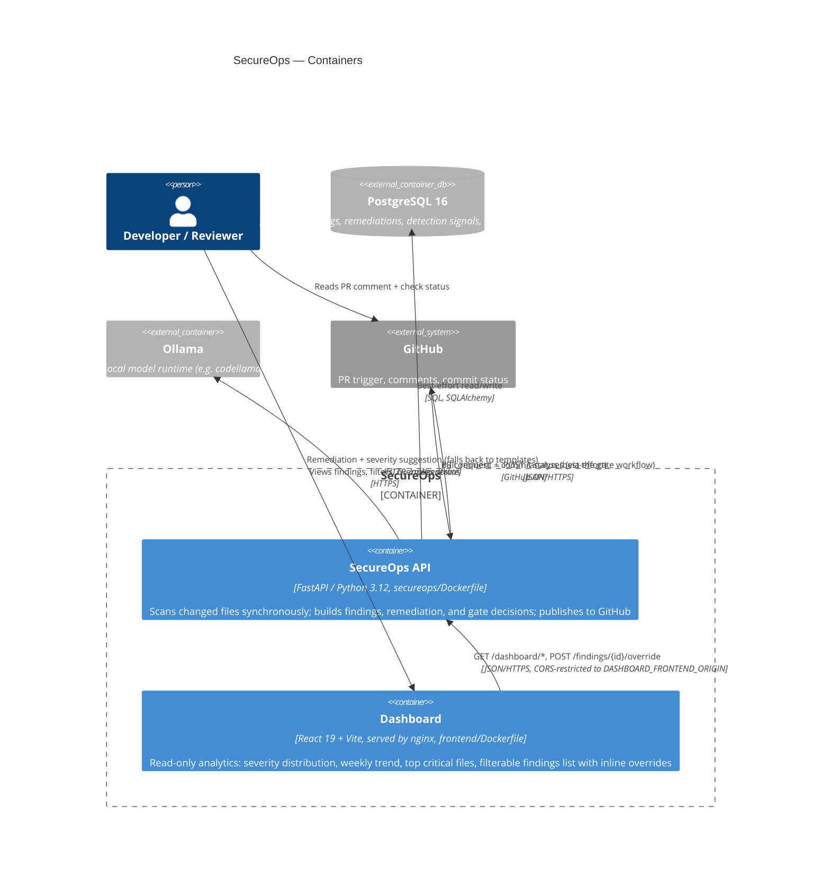

# C4 — Containers

The deployable units — matches `docker-compose.yml` and
`.github/workflows/secureops-gate.yml` exactly; nothing here is aspirational.
See [c4-context.md](c4-context.md) for the system boundary these sit inside.

## Inside the API container

Not separate deployables — Python packages under `secureops/app/`, listed
here because the boundaries matter more than the container count:

| Package | Responsibility |
| --- | --- |
| `app/api/` | HTTP boundary: `/analyses`, `/findings`, `/dashboard`, gate decisions |
| `app/engine/` | Tree-sitter parsing, deterministic rules, taint analysis, fingerprinting |
| `app/remediation/` | Ollama client (remediation text + severity suggestion) with reviewed-template/deterministic fallback |
| `app/github/` | PR comment formatting + redaction, commit status payloads, the one place that calls the GitHub API (`publisher.py`) |
| `app/models/`, `app/db/` | SQLAlchemy models and Alembic migrations |

This split is the one enforced by `.specify/memory/constitution.md`: the
engine and remediation packages never import `app.github` or `app.api`
directly, so a finding's cause/evidence/impact is fully computed before
anything decides whether or how to publish it.
