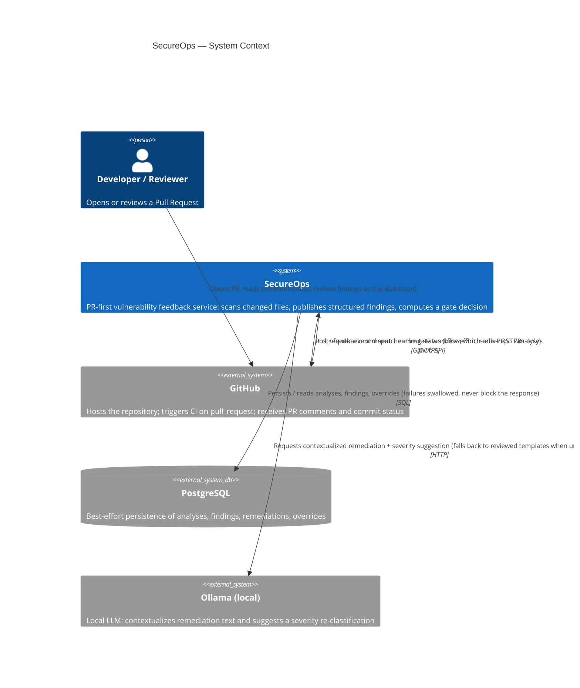

# C4 — System Context

Who and what SecureOps talks to, at the boundary of the system. See
[c4-container.md](c4-container.md) for what's inside the SecureOps box.

**Reading this diagram**: every external relationship on the SecureOps side
is designed to degrade, not fail, when the other system is slow or down —
Postgres failures are swallowed (`app/api/analyses.py`), Ollama failures
fall back to reviewed templates (`app/remediation/service.py`), and GitHub
publish failures return a `PublishResult(published=False, ...)` instead of
raising (`app/github/publisher.py`). Only GitHub-as-trigger is a hard
dependency: without a `pull_request` event (or an equivalent manual
`POST /analyses`), there is nothing to analyze.
